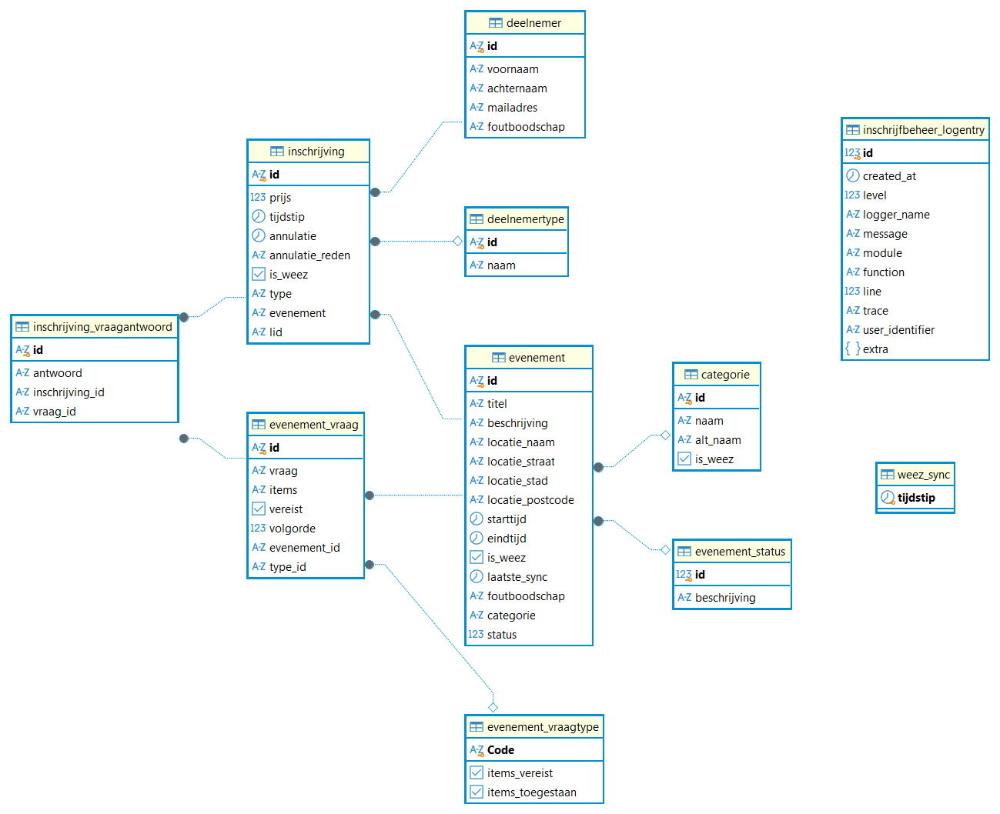

# Databank

`Inschrijfbeheer` maakt gebruik van een eigen databank waar de webapplicatie gebruik van maakt als wijze van een interface en om kostelijke operaties te vermijden.

Alle modellen voor data zijn te vinden in [inschrijfbeheer/models/](../src/inschrijfbeheer/models/).
Deze directory bevat zowel modellen voor `Inschrijfbeheer` zelf als voor de Integreat databank.

## Structuur

De huidige databank heeft volgend diagram

De meeste tabellen en hun verhoudingen met elkaar zijn hier vrij duidelijk.

Er zijn 2 tabellen die los staan van de rest en gebruikt worden voor meta gegevens:
 - **inschrijfbeheer_logentry**: bevat logs over de migraties
 - **weez_sync**: houdt bij wanneer de meest recente synchronisatie van weez gebeurde om dit te gebruiken bij het scrapen van de API voor `last_updated`